```
╔══════════════════════════════════════════════╗
║   ShinRacer  ·  ShinTech Electronics         ║
║   Race. Drift. Coordinate.                   ║
╚══════════════════════════════════════════════╝
```

**Built by the crew. For the crew.**
*No subscriptions. No spreadsheets. No nonsense.*

     

One download link, two installers to pick from — full or Lite. Sign in with Google and go — there's no portable build, no zip to pick by mistake, and there's even a handy app for your phone.

📥 **[Download ShinRacer](https://github.com/ShinobiFPV/ShinRacer/releases/latest)** · **[Download ShinRacer Lite](https://github.com/ShinobiFPV/ShinRacer/releases/latest)** — both installers are on the same release page, grab whichever fits (see [🪶 ShinRacer Lite](#-shinracer-lite) below).

## What is this?

ShinRacer is the app your AC friend group never knew it needed but won't be able to race without.

One app. Everything the crew needs. Server up in 30 seconds, traffic dialed in for a 2am Shutoko run, race night on the calendar, everyone in voice, lap times already logged before you've tabbed back out. No Discord bots stitched to a spreadsheet. No third-party SaaS holding your data hostage. It all runs on a Raspberry Pi in shinobi's setup and a private Tailscale network — nobody outside the crew even knows it exists. One Google sign-in gets you in; there's no password to remember and no account to create.

Hover anything you don't recognize — every control explains what it actually does, not just what its label already told you. And it doesn't look like a spreadsheet with buttons bolted on: true black, electric blue accents, sharp zero-radius corners, Rubik Mono One/Space Mono — a cold, JDM-instrument-cluster look built to actually read at a glance instead of just looking sharp in a screenshot.

## What it does

### 🏁 Server Manager

Your server. Up. Without touching a single config file.

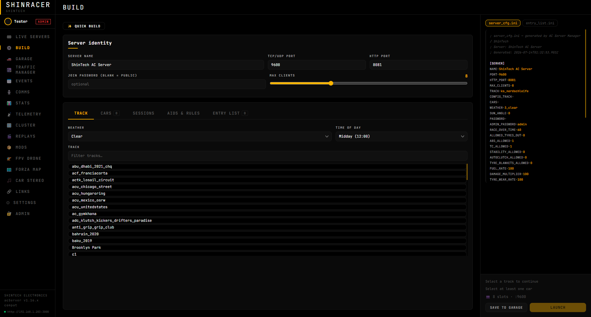

- Track and car picker that actually scans your AC folders — no typing paths
- Practice, qualify, race — set lap counts and durations and go
- Driver aids per server: TC, ABS, stability, autoclutch, tyre blankets, your call
- Entry list editor — car/skin/driver/GUID per slot, no guesswork
- Watch `server_cfg.ini` and `entry_list.ini` build themselves in real time as you configure
- One click and `acServer.exe` is running
- Pit board cards: live player count, uptime, PID, logs streaming as they happen
- Flip on the stracker plugin with a single toggle

### ✨ Server Builder Wizard

Don't want to think about ports and INI keys? Answer a few questions instead.

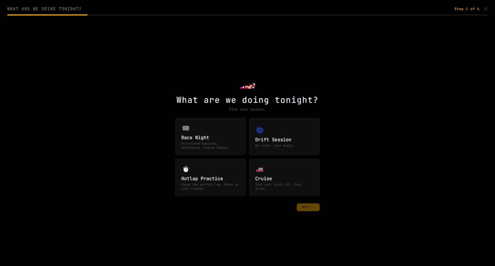

- Step 1 sets the whole vibe — Race Night, Drift Session, Hotlap Practice, or Cruise — and every step after adapts to it
- Track and car pickers pull from your real AC content, same as the full Build form
- Pick weather and time of day off icon cards, with live day/night previews
- House rules in plain English — "Save me from myself" instead of "Traction control" — plus a driver-count slider that tells you when it's "Just the boys" versus "This is a lot of people"
- Last step reads your whole config back in plain English, then launches it or saves it to the Garage
- One click away: "✨ Quick build" in the Build tab, or "✨ Build with wizard" when Live Servers is empty

### 🌆 Traffic Manager

Shutoko at 2am with actual traffic feels different. ShinRacer makes that easy to set up.

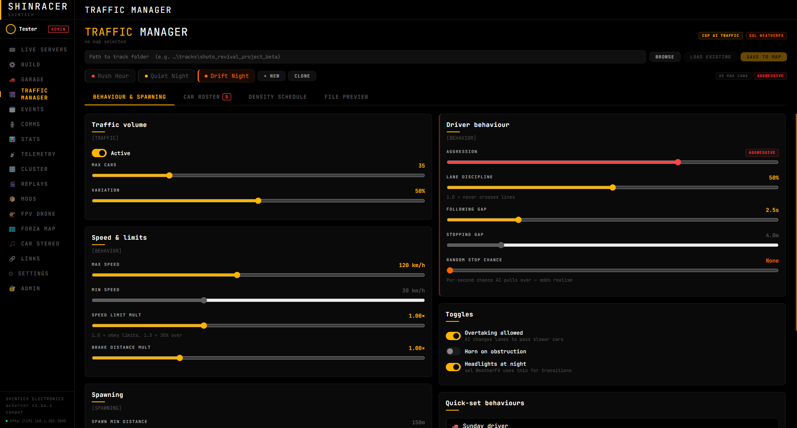

- Load any track's existing `traffic_config.ini` straight into the editor
- Full behaviour control — aggression, speed limits, lane discipline, gaps, spawn distances, every CSP `[BEHAVIOR]`/`[SPAWNING]` key there is
- Build your car roster — model, skin, weight, max count — with a live probability breakdown so you know what's actually going to spawn
- Drag a 24-hour density curve straight onto sol WeatherFX's `DENSITY_HOUR_XX` keys
- Rush Hour, Quiet Night, Drift Night — or build your own profile from scratch
- Hit save and it backs up whatever was there before, timestamped, no questions asked

### 📅 Events Calendar

Stop spamming the group chat trying to organise a race night. Propose it, track who's in, done.

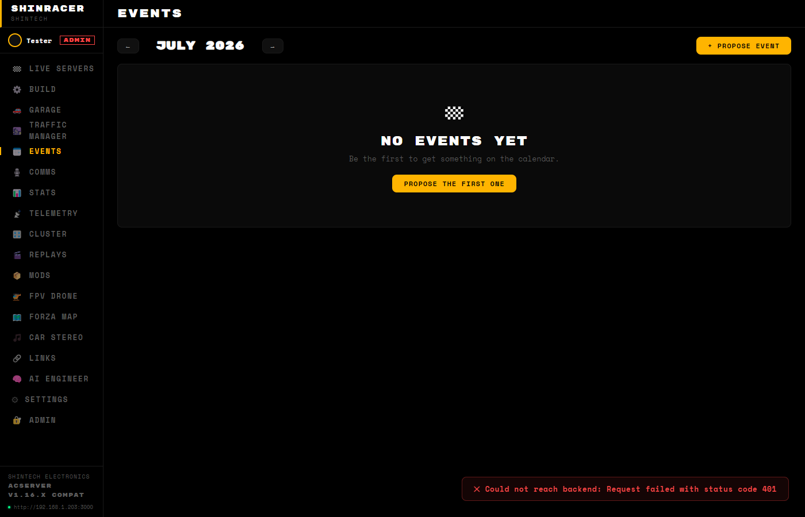

- Month view, color-coded dots for Proposed / Happening / Past
- Propose an event — name, type, track, cars, required mods, poster image if you've got one
- One other person accepts and it's locked in — Proposed becomes Happening
- Edit, cancel, or delete anything — nobody owns an event, it's a crew calendar
- Export to `.ics` and drop it straight into whatever calendar app you actually use
- Generate an invite code and QR on the spot to pull a friend straight into a live server
- 24-hour heads-up notifications so nobody forgets
- One button clears the whole calendar when you need a clean slate

### 🎙️ Comms Hub

Voice comms built in. No Discord. No bots. No latency from a server in another country. Just your crew.

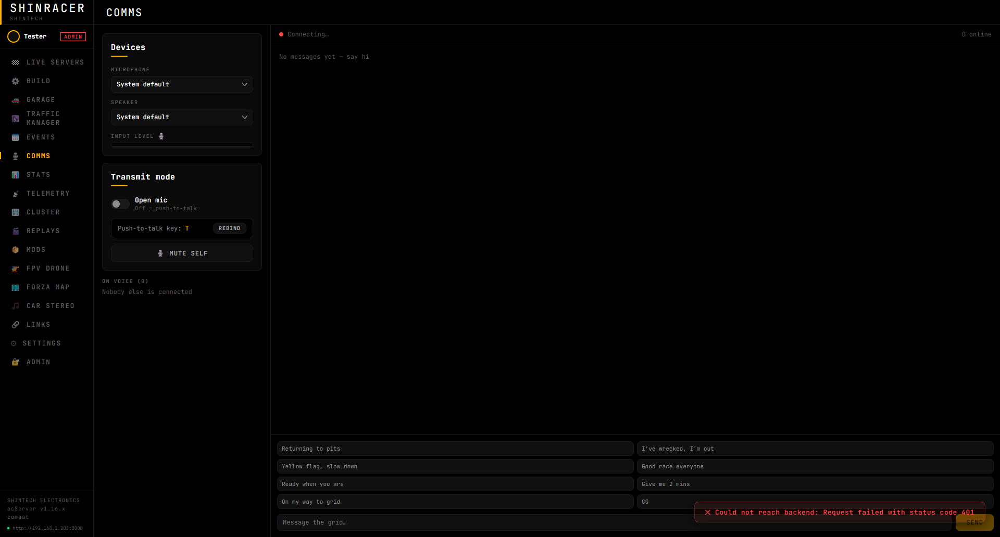

- Full-mesh WebRTC voice, peer to peer — Tailscale handles the routing, no relay server needed
- Pick your mic and speakers, watch a live input meter to make sure you're actually being heard
- Push-to-talk (rebind the key) or leave the mic open
- Per-peer volume sliders that remember your settings next time
- A pulse on whoever's actually talking
- Connection state per peer, with auto-reconnect when someone drops
- Text chat with real history — last 100 messages, always there when you open the tab
- 8 quick-phrase buttons for when you don't want to talk — "Returning to pits," "I've wrecked, I'm out," and more, all editable

### 📊 Lap Stats

Find out exactly how much faster you actually are. Or slower. We don't judge.

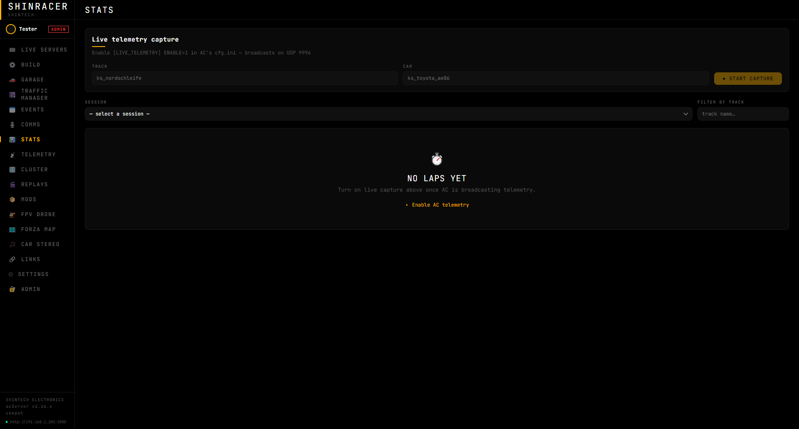

- Captured live off AC's own UDP broadcast on port 9996 — no plugin, no third-party tool
- Every lap split into S1/S2/S3, stacked into a bar chart with your personal best drawn right across it
- Full session leaderboard, ranked by best lap
- Side-by-side comparison against your friends, deltas highlighted so you know exactly where you're losing time
- Invalid laps flagged straight from AC's own data, with a toggle to hide or show them
- Export a session to CSV or JSON whenever you want the raw numbers
- A live "Recording" badge and lap counter so you know it's actually working

### 📡 Live Telemetry

Live data. Every sensor the sim exposes. Tyres, g-force, delta, damage — all of it on screen while you drive. And it's not just AC anymore.

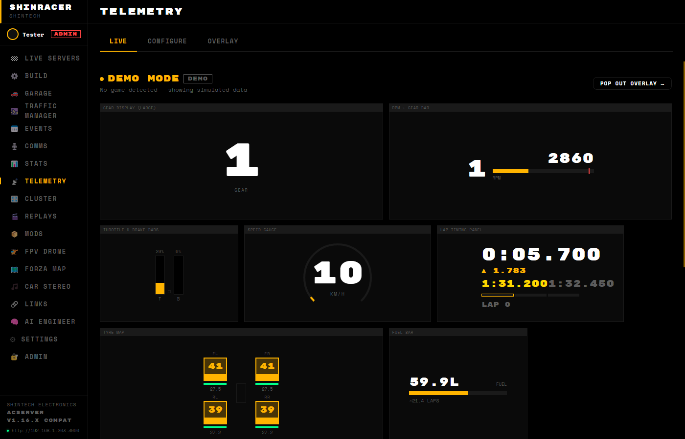

- **Eight games, one dash**: AC1, ACC, AC Evo, and AC Rally over shared memory, FH5, FH6, F1 25, and Automobilista 2 over UDP — auto-detected, no manual switching required
- 17 widgets across 5 categories — Motion (speed, RPM/gear, gear readout, g-force circle, input trace, boost gauge, power/torque), Controls (throttle/brake, steering angle), Tyres (temps, wear, pressures, suspension travel, brake temp where the game exposes it), Session (lap timing, fuel, status, damage, gap ahead/behind), and a stripped-down Minimal readout
- A colored game badge in the LIVE header always shows which sim you're actually reading from — AC1, ACC, AC EVO, AC RALLY, FH5, FH6, or DEMO
- LIVE tab: your widgets, laid out in a grid that reflows to fit
- CONFIGURE tab: toggle what you want, drag to reorder, size each widget, or just load one of 5 presets — Full Dash, Tyre Map, Corner, Timing, Minimal
- OVERLAY tab: pop a second window — frameless, see-through, always on top, drag it anywhere, even right over the game itself
- Nothing running yet? You still get a full simulated lap so you can poke around the whole screen before you've even launched a sim
- AC Evo's shared-memory API is early access and can shift between patches — ShinRacer falls back gracefully per-field and flags it with an orange banner rather than showing garbage
- Nothing here ever touches the backend — it stays on your machine. Full per-game setup: **[docs/TELEMETRY_SETUP.md](docs/TELEMETRY_SETUP.md)**

### 🎛️ The Cluster Fucker

Build your own button box. Design a custom panel of buttons, toggles, gauges, and displays — then run it your way.

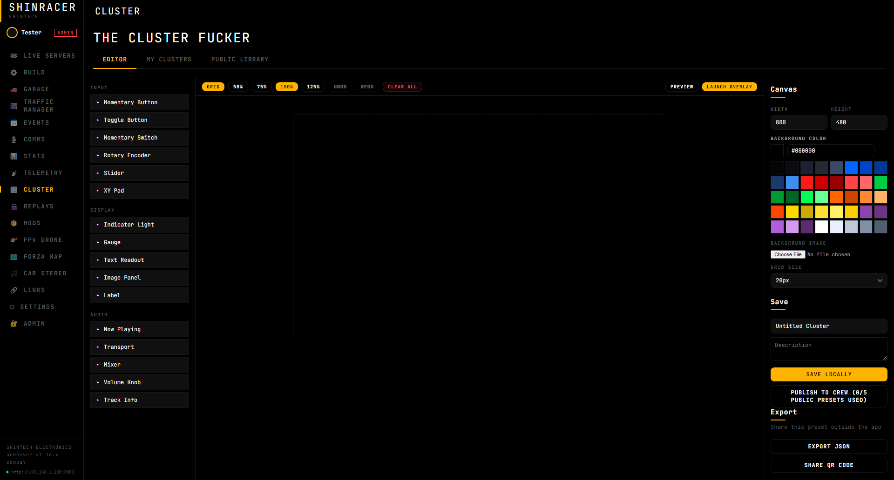

- Full drag-and-drop editor — momentary buttons, toggles, rocker switches, rotary encoders, sliders, an XY pad, indicator lights, gauges, text readouts, image panels, labels. No code, no external tools
- Bind any button to a real keystroke (fires straight into AC) or a ShinRacer function — push-to-talk, quick phrases, launching a server, marking a lap, and more
- Runs as a real overlay window you can drag anywhere over AC, or full-screen on the PWA on a phone propped up next to your wheel — build it once on desktop, publish it, and pull the same layout up on mobile in seconds
- A proper editor, not a toy: undo/redo, grid snap, multi-select, zoom, precise x/y/w/h entry
- Unlimited local presets, publish up to 5 to the crew library, share any preset as a QR code or a JSON file
- Full build-and-share walkthrough: **[docs/CLUSTER_FUCKER.md](docs/CLUSTER_FUCKER.md)**

### 🎵 Car Stereo

Music, game audio, and Comms voice, all in one three-channel mixer — because alt-tabbing to Spotify mid-race is how you end up in the wall.

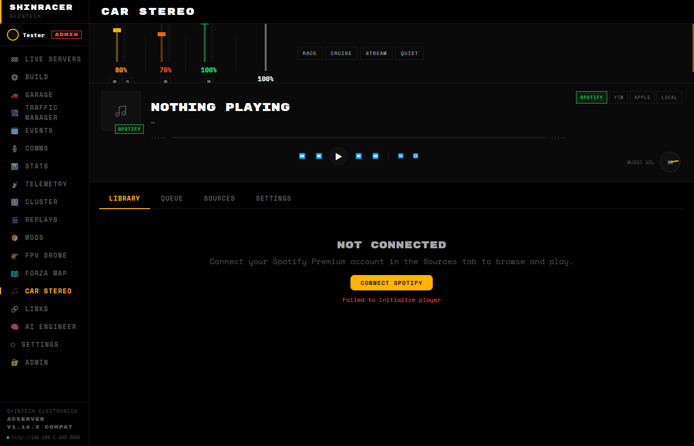

- Spotify (Premium), YouTube Music, and Apple Music — plus local mp3/flac/wav/ogg/m4a/aac files with real ID3-tag metadata and artwork
- Spotify gets full native control (play/pause/skip/seek/shuffle/repeat, search, playlists) via its official SDK; YTM and Apple Music run in an embedded browser panel since neither has a public playback API
- A real three-channel mixer — MUSIC / GAME / COMMS — with per-channel VU meters, mute, solo, a linked master fader, and four built-in presets (RACE / CRUISE / STREAM / QUIET), plus your own
- The GAME channel reaches into your actual game's Windows volume, not just ShinRacer's own
- Five dedicated widgets (Now Playing, Transport, Mixer, Volume Knob, Track Info) drop straight into the Cluster Fucker, so your button box can carry playback controls too
- Full setup walkthrough: **[docs/CAR_STEREO_SETUP.md](docs/CAR_STEREO_SETUP.md)**

### 🎬 Replay Browser

That lap you hit last night? It's in here. Tagged, saved, and one click from reliving it.

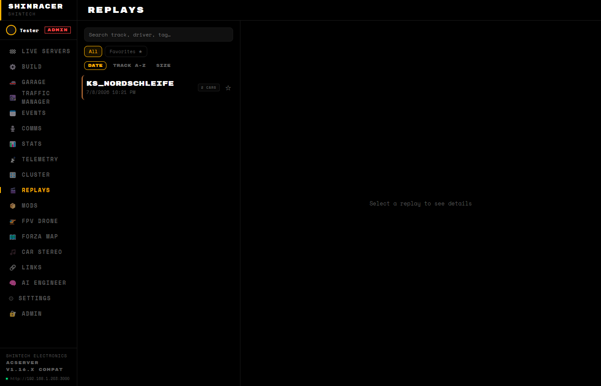

- Scans `Documents\Assetto Corsa\replay\` automatically, no digging through File Explorer
- Pulls track, layout, cars, and driver names straight out of the replay file itself
- Favorite it, tag it, leave yourself a note — all saved locally
- Suggested tags ready to go: race, drift, hotlap, crash, keeper, review
- Search and filter by track, driver, tag, or filename
- Sort by date, track, or file size
- Launch straight into AC, no extra steps
- Re-scans stay fast — metadata's cached and only rebuilt when a file actually changes

### 📦 Mod Manager

The crew's mod collection, in the app. Click install. Done. No zip files. No dragging folders.

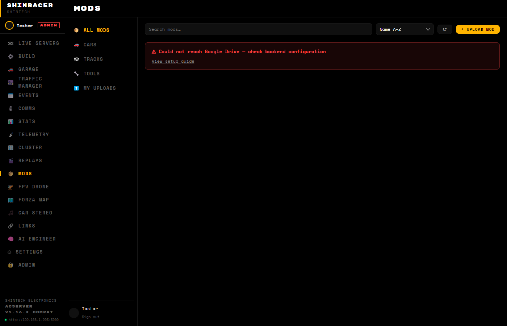

- Browse Cars, Tracks, and Tools straight out of the shared Drive folder
- One click downloads and drops it right into your AC content folders
- A badge tells you the moment something you've got installed is out of date
- Sign in with Google to upload your own finds for William to add to the shelf
- Everyone connected gets a toast the second a new mod lands
- The same sign-in gates the whole app now (see Roles, below) — downloads and browsing don't need any *extra* sign-in beyond that, only uploading ever needed Google in the first place

### 🚁 FPV Drone Assistant

Flying [sug44's FPV Drone mod](https://github.com/sug44/FpvDroneForAC) for AC? ShinRacer's got a dedicated page for it.

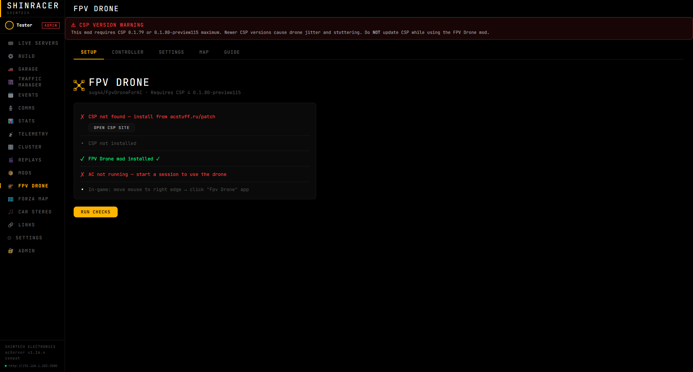

- Checks your mod install and CSP version for you — the drone mod is picky about which CSP builds actually fly right, and this flags a bad pairing before you find out the hard way mid-flight
- Detects your controller (DJI FPV Controller 2/3 or a generic gamepad) and shows a live 60fps axis monitor while you calibrate
- Edit the mod's own flight/rate/camera presets right in the app — a real JSON editor, not a text file you have to hunt down
- A crew position map shows where everyone's actually flying, relative to each other, live
- A built-in reference guide for the mod's own settings, so you're not tabbing out to a wiki mid-session

### 🗺️ Forza World Map

Same crew, same Tailscale network, but this time everyone's in Horizon. See where they actually are.

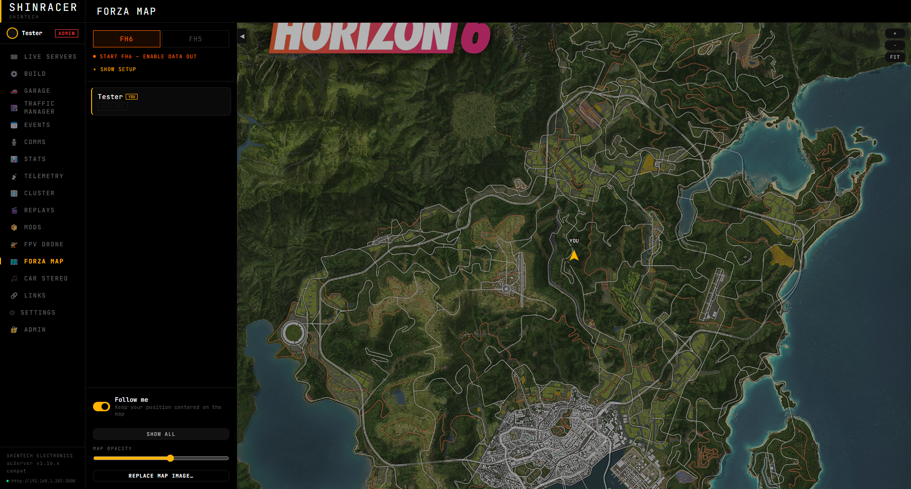

- Every signed-in crew member currently playing FH5 or FH6 shows up live, with a direction arrow and a status — IN RACE, OPEN DRIVING, or IDLE
- Positions are smoothed, not jumpy — real telemetry, lerped between updates so markers glide instead of snapping
- Pan, zoom, "Follow me," or "Show everyone" — your call
- Reuses the same Forza telemetry the Live Telemetry tab already reads, so there's no second thing to set up — if telemetry's on, the map works

### 🔗 Useful Links

Everywhere the crew actually goes for mods, tools, and guides — one tab, not a pinned Discord message from eight months ago.

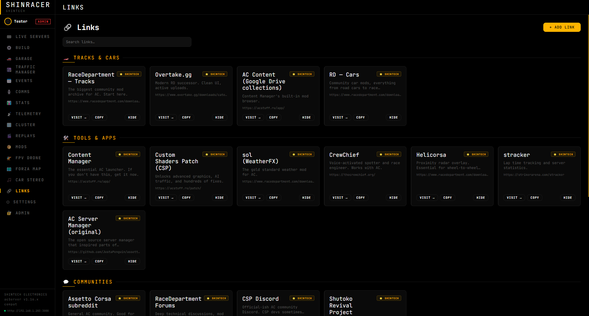

- ~25 links, hand-picked, across five categories: Tracks & Cars, Tools & Apps, Communities, YouTube, and Setup & Guides — RaceDepartment, Overtake.gg, Content Manager, CSP, sol, CrewChief, the AC subreddit, and more
- Don't need one? Hide it. It's not gone, just out of the way — bring it back whenever
- Add your own on top — name, URL, description, category — edit or delete anytime
- Live search across every link's name, description, and URL
- One click to visit (opens in your real browser, never trapped in the app) or copy the link
- Fully local — the built-in list ships with the app, your additions live on your machine, nothing phones home

### 🎙️ AI Race Engineer

Optional. Off by default. Bring your own key and it actually talks back.

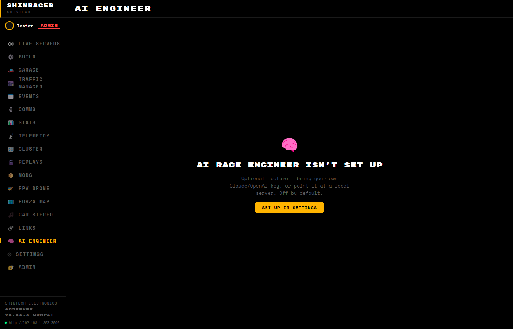

- Bring your own Claude or OpenAI key, or point it at a local model (Ollama, LM Studio, anything OpenAI-compatible) — your call, your cost, your data
- Text chat that sees your live telemetry every turn — ask "how's my fuel?" and it answers with the actual numbers pulled straight from whichever of the eight supported sims you're running, never a guess
- Proactive alerts, no polling required — fuel critical/low, tyre temps cold or overheating, tyre wear past 80%, wheel slip past 0.8, any damage, and race flags — toasted the moment a threshold's crossed, then quiet again until it changes
- Push-to-talk voice — hold the mic button, ask your question out loud, hear it talk back. One Deepgram key handles both directions: `nova-3` for speech-to-text, `aura-2-zeus-en` for the reply, both swappable for any other Deepgram model
- No wake word, no always-listening mic, no voice activity detection — it only hears you while you're physically holding the button down, full stop
- Model, key, and voice settings are all plain text fields — nothing here is locked to a specific provider version, so it keeps working as models change
- Entirely client-side: your key, your telemetry, and everything you say to it go straight to whichever provider you picked and nowhere else — never through the backend, never anywhere near any other ShinTech app
- A "Test connection" and a "Test voice" button in Settings, so you know it's working before you're mid-lap depending on it
- Set it up during the first-run wizard or any time after from Settings — skip it entirely if you don't want it, and toggling it off doesn't lose your key, it just stops using it

### 🔐 Roles & Admin Panel

Every crew member is Admin, Host, or Crew. Nobody types in a password to get there — Google sign-in decides who you are, `roles.json` decides what you can do.

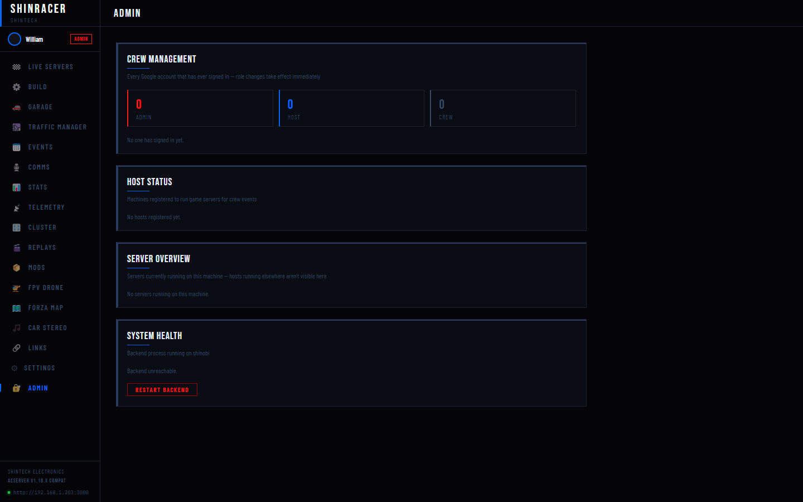

- Three roles: **Admin** (William) manages everyone and everything, **Host** can also volunteer their PC for event servers, **Crew** gets events/comms/stats/mods/links — which covers almost everyone
- Role-gated nav — Host/Admin-only tabs aren't shown-and-disabled to Crew, they're just not there
- Admin panel: crew management with a live role dropdown, host status table, a server overview, and a one-click backend restart
- Proposing an event only shows "I'll host" to people who actually can — Crew only ever sees "Shinobi hosts," full stop
- Full breakdown: **[docs/ADMIN_SETUP.md](docs/ADMIN_SETUP.md)**

### 🧙 First-Run Wizard

New to the crew? Sign in with Google and you're in — the app fills in the rest from there.

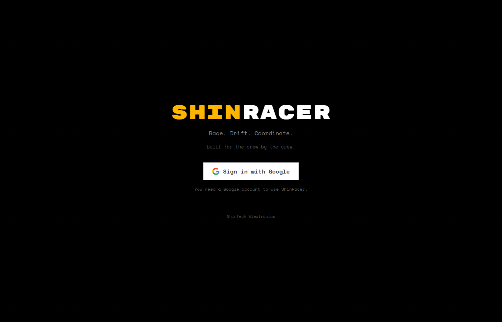

- **Sign in with Google** is step one; your handle and color default from your Google profile and are yours to change right after
- Finds your AC install on its own from the usual Steam paths
- Host or Admin? Two extra steps appear — AC path confirmation and a host-readiness check. Everyone else skips straight past them
- Backend URL's already filled in — just hit test and confirm it connects
- Set up your quick-phrases while you're at it
- AI Race Engineer step — paste a Claude/OpenAI key or point it at a local server, or just skip it; entirely optional and just as easy to turn on later from Settings
- Nothing saves until you hit "Done" on the last screen

## For the crew on mobile

Not everyone needs the full desktop app. The ShinRacer PWA gets your friends
in without installing anything — a real second app, same backend, own
codebase, sitting on their home screen with its own icon and zero browser
chrome once it's installed.

- **Events** — the same crew calendar, cards instead of a full grid (a
  month view is a lot of screen for a phone), propose/accept/edit/cancel,
  the same iCal export
- **Comms** — full voice and text, hold-to-talk built for a thumb instead of
  a keybind, same WebRTC mesh as the desktop app so a phone and three
  laptops can all be in the same call
- **Mods** — browse and download anytime; upload if you're signed in (same
  account, same rules as desktop)
- **Stats** — a simplified read-only lap chart, same data as the full
  Electron dashboard, sized for a small screen
- **Links** — the same crew link list, long-press to copy on a phone
  instead of a right-click
- **The Cluster Fucker** — pull up any published button-box preset
  full-screen, right next to your wheel or your phone mount
- **Push notifications** — a real system notification when a new event
  goes up or a mod lands in the library, even with the app closed
- Sign in with Google, same as desktop — the same mandatory account, the
  same Admin/Host/Crew role, no separate guest mode to keep straight

**On Tailscale?** Open `https://shinobi.tail9249a1.ts.net:8443`, sign in,
tap Share → Add to Home Screen, done. No App Store. No Play Store. Just a
link. (Use the HTTPS URL, not the plain-HTTP `:8080` one — Google sign-in
needs it.)

Full mobile setup, VAPID push notifications, and the nginx config that
serves it: **[docs/PWA_SETUP.md](docs/PWA_SETUP.md)**.

## 🪶 ShinRacer Lite

Not everyone wants the whole toolbox. Some of the crew just want to show up, join a race, grab a mod, and talk to people — that's ShinRacer Lite.

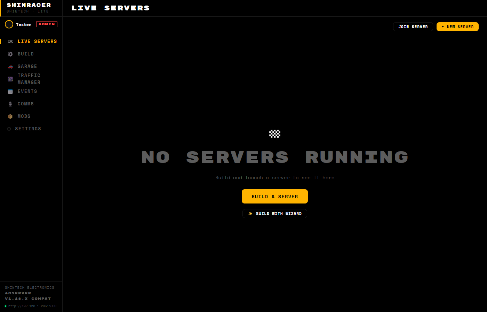

It's not a stripped-down fork or a second codebase to keep in sync — Lite is built from the exact same `src/` tree as the full app, packaged by a second electron-builder config (`electron-builder-lite.yml`) that just changes which nav items are visible. Every bug fix and every feature that lands in Full ships in Lite's next release too, automatically, because it's the same source.

| | ShinRacer | ShinRacer Lite |
|---|---|---|
| Live Servers, Build, Garage | ✅ | ✅ |
| Traffic Manager | ✅ | ✅ |
| Events Calendar | ✅ | ✅ |
| Comms Hub (voice + chat) | ✅ | ✅ |
| Mod Manager | ✅ | ✅ |
| Settings | ✅ | ✅ |
| Lap Stats | ✅ | — |
| Live Telemetry (8 games) | ✅ | — |
| The Cluster Fucker | ✅ | — |
| Replay Browser | ✅ | — |
| FPV Drone Assistant | ✅ | — |
| Forza World Map | ✅ | — |
| Car Stereo | ✅ | — |
| Useful Links | ✅ | — |
| AI Race Engineer | ✅ | — |
| Admin panel (Admin role only, either build) | ✅ | ✅ |

Same backend, same Google sign-in, same roles, same auto-updater, same everything under the hood — Lite just hides the sidebar items most casual crew never open. Nav visibility is a fixed allowlist independent of role, so even an Admin account on a Lite install only sees the 8 items above; role gating (Host/Admin/Crew) still applies on top of that exactly as it does in Full.

Don't want a second install just to try it? Flip **App mode → Lite Mode** in Settings on the regular ShinRacer app — it hides the exact same nav items at runtime, on the same install, restorable with the same toggle any time. If you're on a hidden page when you turn it on, you're bounced back to Live Servers rather than left on a page you can no longer see.

Both installers are published together on every release, sharing one version number. Grab whichever one fits from **[GitHub Releases](https://github.com/ShinobiFPV/ShinRacer/releases/latest)**:

- `ShinRacer Setup x.x.x.exe` — everything
- `ShinRacer Lite Setup x.x.x.exe` — servers, events, mods, comms, traffic

Build/packaging details for maintainers: **[docs/RELEASING.md#shinracer-lite](docs/RELEASING.md#shinracer-lite)**.

## How it works

The heavy lifting runs on a Pi 5 in shinobi's setup. Everyone else just runs the app.

```
┌─────────────────────────────────┐
│   ScarlettWitch (Windows 11)    │
│                                 │
│  ┌───────────────────────────┐  │
│  │   Electron + React App    │  │
│  │   (ShinRacer)             │  │
│  └────────────┬──────────────┘  │
│               │ IPC             │
│  ┌────────────▼──────────────┐  │
│  │   Main Process (Node.js)  │  │
│  │   acServer.exe spawner    │  │
│  │   UDP telemetry (9996)    │  │
│  │   Multi-game telemetry    │  │
│  │   accomp:// URL handler   │  │
│  └───────────────────────────┘  │
└──────────────┬──────────────────┘
               │ HTTP + WebSocket
               │ (Tailscale / LAN)
┌──────────────▼──────────────────┐
│   shinobi (Raspberry Pi 5)      │
│                                 │
│  ┌───────────────────────────┐  │
│  │   Node.js + Express       │  │
│  │   Socket.io               │  │
│  │   SQLite (ac_companion.db)│  │
│  └───────────────────────────┘  │
└─────────────────────────────────┘
```

**The app on your machine** does everything that needs real OS access: spawns and watches `acServer.exe`, listens for AC's UDP telemetry, auto-detects and reads live telemetry from whichever of the eight supported sims is actually running (shared memory for the AC family, UDP for Forza/F1 25/AMS2) for the Live Telemetry tab, touches your AC config files, and catches `accomp://` links so invites just work. The interface itself never touches any of that directly — it all goes through Electron's IPC bridge.

**The backend** is the one thing that has to be shared — a small always-on Node service holding the events calendar, chat history, WebRTC signaling, lap stats, host registrations, roles, and invite codes in a single SQLite database, pushing realtime updates over Socket.io. It lives on shinobi's Pi 5 as a systemd service, but there's nothing Pi-specific about it — any always-on box on the network does the job. The same Pi also serves the mobile PWA over nginx (not pictured above, for diagram simplicity) — same backend, separate codebase, separate deploy.

Every request to the backend — from the desktop app, the PWA, either one — carries a Google ID token, verified against Google's own servers on every single call. Nothing in this diagram trusts a client just because it asked nicely.

Server Manager, Traffic Manager, Live Telemetry, the Replay Browser, and the AI Race Engineer don't need the backend at all — that's just you, your AC install, and (for the AI Race Engineer) whichever LLM/Deepgram provider you brought your own key for. Events, Comms, Stats, and the Admin panel do, because those are the parts that are actually shared. Mod Manager needs it too for browsing and downloads (it's just proxying Drive), and — since Phase 12 — so does everything else, because signing in is how ShinRacer knows who you are at all now.

## Under the hood

Since you asked:

| Layer | Technology |
|-------|-----------|
| Desktop shell | Electron 28 |
| UI | React 18 + Vite 5 |
| Styling | Inline styles, custom design system — true black, electric blue, Rubik Mono One/Space Mono (no CSS framework) |
| Backend | Node.js 24 + Express |
| Realtime | Socket.io 4 |
| Database | SQLite via better-sqlite3 |
| Voice (Comms) | WebRTC (browser APIs, peer-to-peer mesh) |
| AI Race Engineer | Bring-your-own-key: Claude, OpenAI, or any local OpenAI-compatible server (Ollama, LM Studio) — client-side only, no backend involved |
| AI voice (STT/TTS) | Deepgram REST API, push-to-talk only — no wake word |
| Auth | Google Sign-In (OAuth 2.0 + ID tokens), role-based access via `roles.json` |
| Telemetry | Shared memory (AC1, ACC, AC Evo, AC Rally) + UDP (FH5, FH6, F1 25, AMS2), one canonical frame shape |
| Music | Spotify Web Playback SDK + Web API, embedded BrowserViews for YouTube Music/Apple Music, music-metadata for local file tags |
| Mod library | Google Drive API + OAuth (googleapis) |
| Keystroke dispatch | robotjs (PowerShell SendKeys fallback) |
| Mobile app | PWA (React + Vite, service worker via vite-plugin-pwa), served through nginx |
| Push notifications | Web Push (VAPID keys, web-push) |
| Networking | Tailscale (or LAN) |
| Deployment | Raspberry Pi 5 + systemd |
| Build | electron-builder (single NSIS installer), GitHub Actions |
| Auto-update | electron-updater — in-app banner, checks GitHub Releases, restart-to-install |

## Let's go

### If you're hosting (shinobi)

You need Node 24. You probably already have it. Past that:

**Prerequisites**
- Windows 10/11 x64
- Node.js 24+ ([nodejs.org](https://nodejs.org))
- Assetto Corsa installed via Steam
- A Raspberry Pi (or any always-on Linux box) for the backend
- Tailscale on all devices ([tailscale.com](https://tailscale.com))
- A Google Cloud project + OAuth client — every route requires a signed-in Google account now, not just Mod Manager uploads. See **[docs/GOOGLE_DRIVE_SETUP.md](docs/GOOGLE_DRIVE_SETUP.md)**

**Steps**

```powershell
# 1. Clone the repo
git clone https://github.com/ShinobiFPV/ShinRacer.git
cd ShinRacer

# 2. Install dependencies
npm install
cd backend && npm install && cd ..

# 3. Deploy the backend to your Pi (edit host/user in the script first)
.\scripts\deploy-backend.ps1

# 4. Run the app
npm run dev        # dev mode, hot reload
# or
npm run build       # production installer
```

First launch runs the setup wizard — sign in with Google, find your AC install, set a handle and color, and hook straight into the backend you just stood up. Since you're standing this up for the first time, you'll also need to bootstrap yourself as the first Admin by hand-editing `backend/config/roles.json` on the Pi — see **[docs/ADMIN_SETUP.md](docs/ADMIN_SETUP.md)**.

### If you're joining the crew

William sent you here. Good. Do this:

1. Get a Tailscale invite from William
2. Send William the Google account you'll sign in with, so he can add you to the crew list
3. Grab the latest installer: [GitHub Releases](https://github.com/ShinobiFPV/ShinRacer/releases/latest) — `ShinRacer Setup x.x.x.exe` for everything, or `ShinRacer Lite Setup x.x.x.exe` if you just want servers/events, mods, comms, and traffic management without the rest of the app (see below)
4. Run it — Windows might throw a SmartScreen warning since it's unsigned for now. Click "More info" → "Run anyway."
5. Run through the setup wizard — **Sign in with Google** first, then handle/color (defaulted from your Google profile), then hit Test Connection on the backend (it's pre-filled)
6. You're in. Check Events for what's coming up.

The whole thing takes about 5 minutes. After that, updates find you — a banner shows up in-app when a new version's out, no need to redownload the installer.

Full step-by-step: **[docs/FRIEND_SETUP.md](docs/FRIEND_SETUP.md)**

**Not everyone needs the whole app.** See **[🪶 ShinRacer Lite](#-shinracer-lite)** above — same install, same code, same account, just a shorter sidebar.

### Roles

| Role | Who | Gets |
|------|-----|------|
| **Admin** | William | Everything Host has, plus the Admin panel — crew role management, host status, server overview, backend restart |
| **Host** | Anyone trusted to run a game server for crew events | Everything Crew has, plus Server Manager, Traffic Manager, Live Telemetry, and the "I'll host" option when proposing an event |
| **Crew** | Everyone signed in | Events, Comms, Stats, Mods, Replays, Links, Cluster Fucker, Settings |

Roles live in `backend/config/roles.json` on shinobi (not in git, not in the
database) and apply instantly — no restart, no redeploy. Full setup and
promotion flow: **[docs/ADMIN_SETUP.md](docs/ADMIN_SETUP.md)**.

## Deploying the backend

One command. 15 seconds. Done:

```powershell
.\scripts\deploy-backend.ps1
```

It copies the backend source over `scp`, runs `npm install --omit=dev` on the Pi, restarts the `ac-companion` systemd service, and prints back a health check so you know it actually came up clean.

Setting up a brand-new Pi is the only manual part: copy the backend files over, `npm install`, drop `backend/ac-companion.service` into `/etc/systemd/system/`, then `systemctl enable --now ac-companion`. After that, it's the one command above, forever.

Health check endpoint: `GET /api/health`

## Getting live telemetry

ShinRacer pulls telemetry out of AC two different ways, for two different screens.

**Lap Stats** needs one quick change — two lines in a config file. That's it.

```ini
[LIVE_TELEMETRY]
ENABLE=1
APP_ID=race_stats
UDP_PORT=9996
```

Find `cfg.ini` here, depending on whether you're running vanilla AC or through Content Manager:

```
%LOCALAPPDATA%\AcTools Content Manager\data\cfg\cfg.ini
```
or
```
Documents\Assetto Corsa\cfg\cfg.ini
```

**Live Telemetry** — the LIVE/CONFIGURE/OVERLAY dash — auto-detects whichever supported game is running (AC1, ACC, AC Evo, AC Rally, FH5/FH6, F1 25, or Automobilista 2) and needs no setup for most of them. Just open the tab. If nothing's running yet, you'll get a simulated lap until it is. Forza, F1 25, and AMS2 each need one in-game setting flipped on; full breakdown per game: **[docs/TELEMETRY_SETUP.md](docs/TELEMETRY_SETUP.md)**.

## Setting up SRP traffic

Shutoko with no traffic is a different experience. Here's how to set it up properly:

1. Open the **Traffic Manager** tab
2. Hit **Browse** and point it at your track folder, e.g.:
   ```
   Steam\steamapps\common\assettocorsa\content\tracks\shuto_revival_project_beta
   ```
3. Click **Load existing** — it reads whatever `traffic_config.ini` already ships with the map
4. Pick the **Drift Night** profile, or clone it and make it yours
5. Swap in whatever JDM car mods you've actually got installed
6. Set your density peaks for whenever you actually race
7. Hit **Save to map** — the original gets backed up automatically, timestamped, in `data/traffic/backup/`

## Credits

ShinRacer was built by William (shinobi) over a series of late nights with a lot of help from [Claude](https://claude.ai) (Anthropic's AI) and [Claude Code](https://claude.ai/code), which wrote the vast majority of the actual code. William's job was knowing what to build, how it should feel, and making sure it actually worked when it landed on real hardware. Claude's job was everything else.

If you've ever wondered what it looks like when a builder uses AI as a genuine force multiplier rather than a gimmick — this is it.

**Key technologies**
- [Electron](https://electronjs.org) — desktop shell
- [React](https://react.dev) — UI
- [Socket.io](https://socket.io) — realtime communication
- [better-sqlite3](https://github.com/WiseLibs/better-sqlite3) — database
- [Vite](https://vitejs.dev) — build tooling
- [electron-builder](https://electron.build) — packaging
- [qrcode-generator](https://github.com/kazuhikoarase/qrcode-generator) — invite QR codes
- [googleapis](https://github.com/googleapis/google-api-nodejs-client) — Google Drive, OAuth, and sign-in
- [vite-plugin-pwa](https://vite-pwa-org.netlify.app) — the mobile app's service worker
- [web-push](https://github.com/web-push-libs/web-push) — push notifications
- [robotjs](https://github.com/octalmage/robotjs) — keystroke dispatch for The Cluster Fucker

**Community**
- The Assetto Corsa modding community for track and car content
- CSP (Custom Shaders Patch) by x4fab
- sol by Peter Boese
- Shutoko Revival Project team
- Content Manager by AcTools

## License

MIT License — see [LICENSE](LICENSE) file.

This project is not affiliated with Kunos Simulazioni or Assetto Corsa. All game content, trademarks, and intellectual property belong to their respective owners.

---
*Built for the crew by the crew · ShinTech Electronics*
*Powered by Claude*
